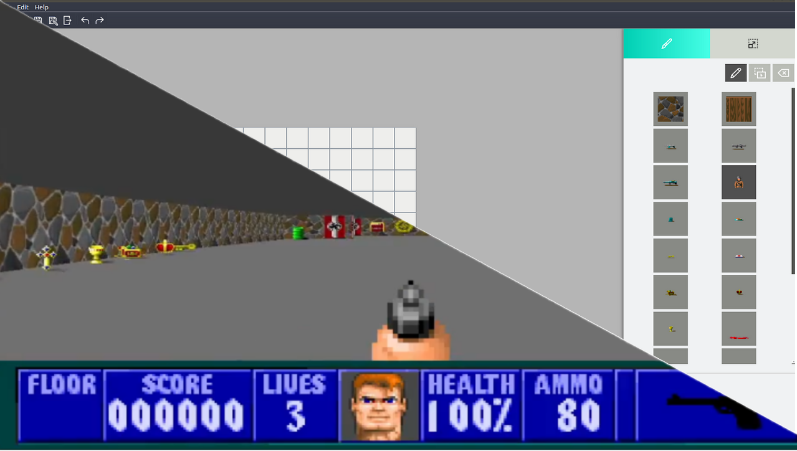

# Wolfenstein-Taller1

## Integrantes

| Nombre                                                        | Padrón |
| ------------------------------------------------------------- | ------ |
| [BIANCARDI, Julian](https://github.com/JulianBiancardi)       | 103945 |
| [CZOP, Santiago](https://github.com/Santiago-Czop)            | 104057 |
| [GIARDINA, Fernando](https://github.com/FerGiardina)          | 103732 |
| [STENGHELE, Juan Francisco](https://github.com/JuanStenghele) | 104000 |
     
Corrector: **[DI PAOLA, Martin](https://github.com/eldipa)**

# Indice   
1. [Introducción](#id1)
2. [Requisitos](#id2)
3. [Instalación](#id3)
4. [Ejecución](#id4)
5. [Juego](#id5)
6. [Editor](#id6)
7. [Screenshoots](#id7)

## 1. Introducción

Este juego, inspirado en el original Wolfenstein3d, es parte del trabajo final y grupal realizado para la materia de Taller de Programación I dictada en la Facultad de Ingeniería de la Universidad de Buenos Aires (FIUBA) durante el segundo cuatrimestre del 2020.

## 2. Requisitos

* SDL, SDL_image, SDL_ttf, SDL_mixer
* QT5
* Lua
* Sistema operativo: Linux

## 3. Instalación

Abrir una consola en la raiz del proyecto (Ctrl + Alt + T) y ejecutar el siguiente comando:

        $ bash installer.sh
        
El instalador contiene los siguientes comandos que usted puede utilizar:

 - a: instala todo el juego más las dependencias necesarias
 - i: instala solo las dependencias necesarias
 - u: desistala el juego
 - h: muestra los comandos disponibles
 - q: salir del instalador

Se aconseja utilizar el comando **a** para garantizar el correcto funcionamiento de los aplicativos.

## 4. Ejecución

Una vez instalado el juego completo más las dependecias necesarias, se generarán tres(3) archivos ejecutables:

 * server
 * wolfenstein3D
 * editor

El archivo **server** representa el servidor del juego. El mismo se corre con el siguiente comando:

        $ ./server

El archivo **wolfenstein3D** representa a un cliente. El mismo se corre con el siguiente comando:

        $ ./wolfenstein3D

El archivo **editor** representa el editor de mapas. El mismo se corre con el siguiente comando:

        $ ./editor

Ver la guía de usuario <EditorManual.pdf>

## 7. Screenshoots

